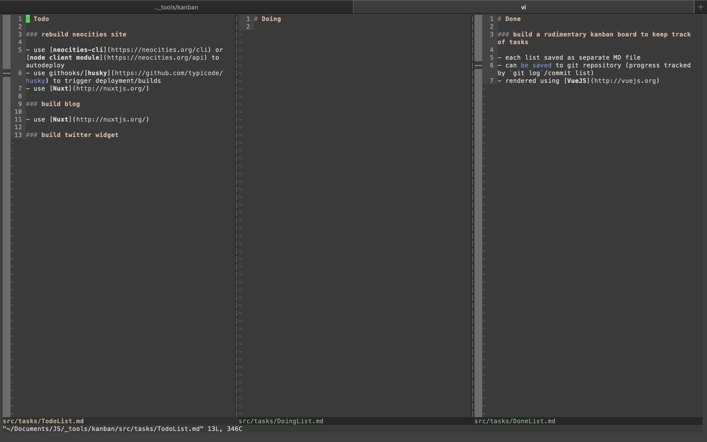
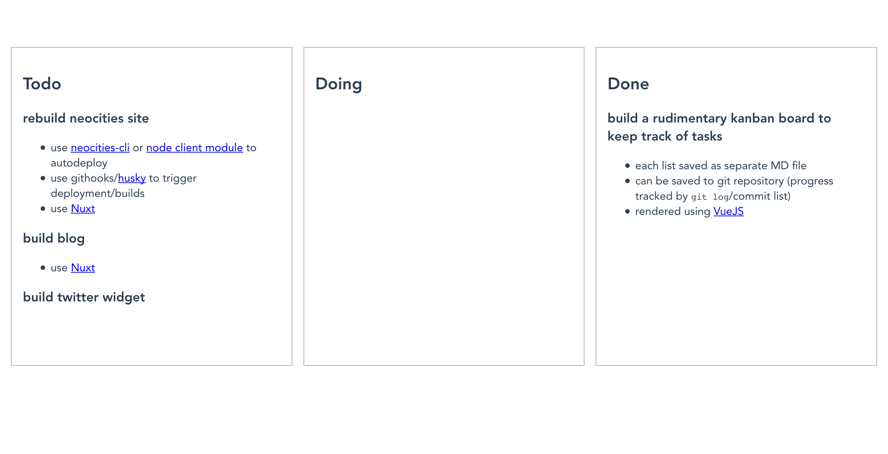

# kanban

Rudimentary [kanban board](https://en.wikipedia.org/wiki/Kanban_board) built using [Vue](http://vuejs.org) inspired by [choo-ban](https://github.com/luizbaldi/choo-ban)





## Progress

[Current Tasks](src/tasks)

### Project setup
```
npm install
```

### Compiles and hot-reloads for development
```
npm run serve
```

### Compiles and minifies for production
```
npm run build
```

### Lints and fixes files
```
npm run lint
```

### Run your unit tests
```
npm run test:unit
```
